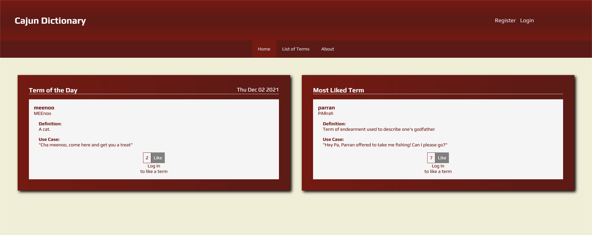

# Cajun Dictionary

[Live Demo](https://cajun-dictionary.herokuapp.com)

## Overview

Cajun Dicitionary is an app containing a library of terms used by Cajuns in the Lafayette area. 

## Features

- Authentication

- CRUD functions

- Word of the Day

- Search bar

## Tech Stack

### Client

- HTML

- CSS

- JavaScript

### Server

- Node

- Express

- PostgreSQL

### Instructions to Install and Run

- Clone this repo

- Navigate into top level folder (cajun-dictionary)

- Run `npm i` to install dependencies

- Run `nodemon` from your terminal

- Navigate to [localhost:3000](http://localhost:3000) in your browser

- Learn